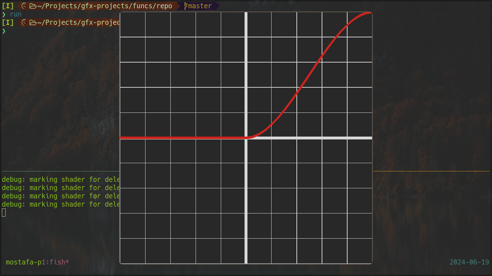
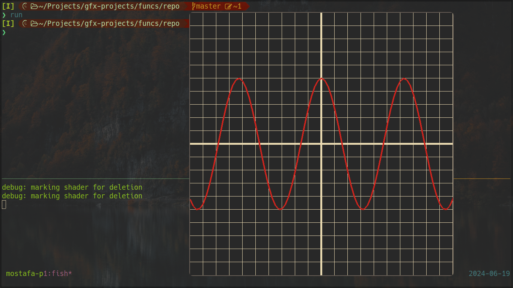

# C++ OpenGL function editor
This is a program that draws a certain function using c++. It loads this function from libplug.so
the function (func in my program) can be loaded using a hot-reload technique if you pressed R key. 
The weird truth about this program is that it draws the functions using c++, No mouse, no visual editor

### Build this program
- you need my graphics project [https://github.com/Mostafa-Khab/gfx-project.git](https://github.com/Mostafa-Khab/gfx-project.git) which depends on opengl, glfw.
- after compiling both gfx-project repo and this one. you can draw whatever function you want. if you modified this function. recompile libplug.so, and press R simply.

### More than one function?
- you can have more than one function. add the function in src/plug.hpp in LIST_OF_FUNCS in PLUG_FUNC, then
define the function in src/plug.cpp. recompile the program and now you can see this function. don't forget to 
define the color for the function. see (src/plug.cpp)
- you can edit this functions at runtime, rebuild your plugin and press R, you functions should be updated(that easy).
- you can edit also colors as well (see src/plug.cpp). BUT you MUST define the color for your function!!

### In this program, you can find some interesting techniques:
- hot-reloading code with dlfcn.h header using POSIX.
- X_macro to be able to draw many functions without even touching main.cpp. (but you still need to recompile)
- these tricks were learnt from a weird Russian man who owns a YT channel called tsoding-daily. 

### NOTE
- Now graph-calc is supported on Windows :smile:.

